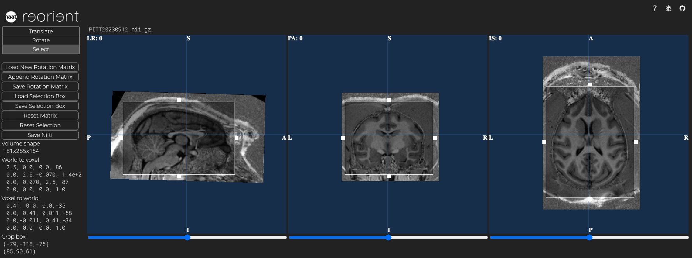
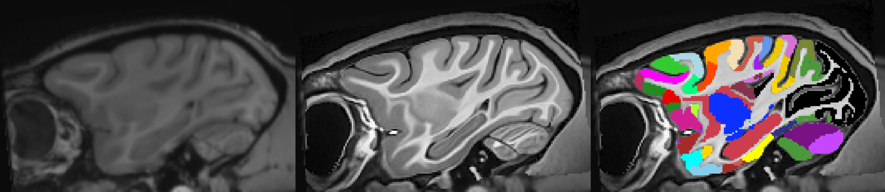
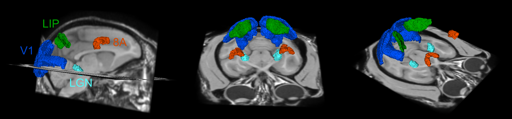
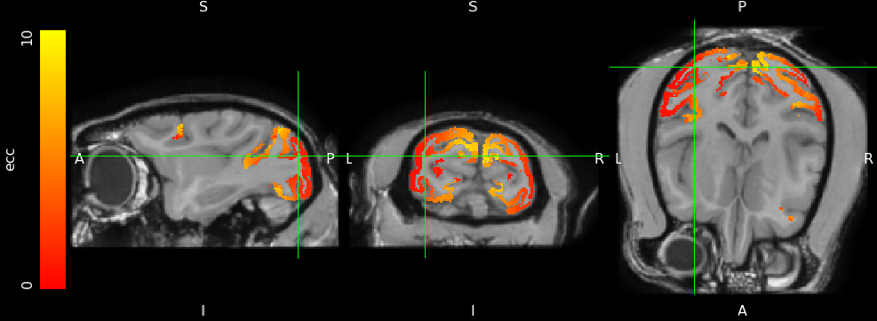
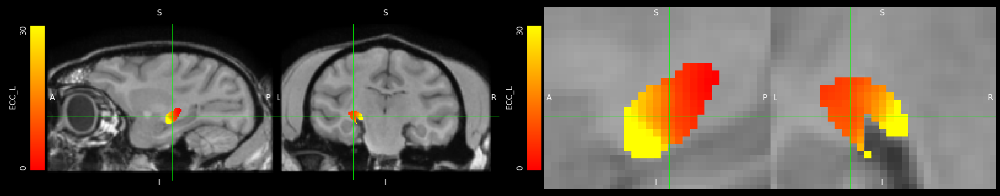
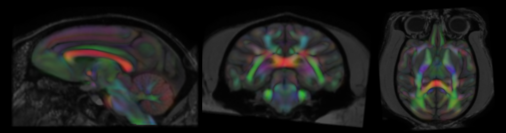

# NHP-TemplateScripts
This package performs a registration of the NIH Macaque Template (NMT) brain to the structural MRI scan of an individual monkey (and the other way around). It will also automatically register detailed cortical and subcortical atlases (i.e. CHARM and SARM) and a broad range of additional information (optional), containing probablistic DTI and retinotopy (cortex and LGN).

 

Basic registrations requires:
- `AFNI` [https://afni.nimh.nih.gov/](https://afni.nimh.nih.gov/)    
- The template package: [NMTv2.0](https://afni.nimh.nih.gov/pub/dist/doc/htmldoc/nonhuman/macaque_tempatl/template_nmtv2.html)

After downloading the NMT we suggest saving it in the following file structure on your local PC or network:    
`<where-you-want>/NMT_v2.0/NMT_v2.0_sym` and `<where-you-want>/NMT_v2.0/NMT_v2.0_asym` 

 

Download this package of scripts and save it wherever you want. The scripts should be aware of their relative positions and function at any location as long as the package structure is intact. The bulk of the work is done by the `ssreg_*.sh` scripts (see below) but the `Batch` folder also contain scripts to configure multiple procedures for multiple individuals. 

**Note on Parallel Processing**: The default is to run these scripts serially (i.e. one by one). If you want to do things in parallel, you will need to run multiple instances or come up with a script yourself. Do note that non-linear registration in particular can take quite some computational resources, so be careful when initiating several at once on a computer with limited resources.

 

## Step 1: Prepare the individual scan    
If you have a T1 or T2 scan of reasonable quality (the procedure is pretty forgiving). You will first need to make sure the orientation is (roughly) correct and the image cropped around the head with not too much empty space. Use your favorite tools to do this, our methods tend to involve:    

 

- `dcm2niix` to convert DICOM files to nifti. Get it at [NITRC](https://www.nitrc.org/plugins/mwiki/index.php/dcm2nii:MainPage)

 

- `Freesurfer`'s `mri_convert` takes a `--sphinx` flag to correct for animals in a sphinx orientation 
in a human scanner. See the [documentation](https://surfer.nmr.mgh.harvard.edu/fswiki/mri_convert)

 

- [Reorient](https://neuroanatomy.github.io/reorient/) is a nice web tool to quickly rotate, translate, 
and crop nifti files to approximate APCP orientation. This works best for subsequent steps. (see screenshot below)

 

- You can also open and check nifti files in your favourite viewer (Such as [FSLeyes](https://fsl.fmrib.ox.ac.uk/fsl/fslwiki/FSLeyes) or [Freeview](https://surfer.nmr.mgh.harvard.edu/fswiki/DownloadAndInstall))

 

Example code averaging over multiple volumes (T1s or T2s)

<pre>$ When acquiring several volumes in the same space (i.e. several T1s during an anaesthetized session), you can take the mean of these volumes.
$ Here is some example code using FSL functions (subject = 'Aapie', and we have three T1 scans in the same space):  
fslmaths Aapie_T1_run1.nii.gz -add Aapie_T1_run2.nii.gz Aapie_temp.nii.gz
fslmaths Aapie_temp.nii.gz -add Aapie_T1_run3.nii.gz Aapie_temp2.nii.gz
fslmaths Aapie_temp2.nii.gz -div 3 Aapie.nii.gz
rm Aapie_temp*.nii.gz  
</pre>

Example code using mri_convert to reorient a volume

<pre>$ Reorientation of a scan acquired in the sphynx position that the monkey is in
$ RAS refers to the coordinate system (dimension 1: right,dimension 2: anterior,dimension 3: superior)
mri_convert -i Aapie.nii.gz -o Aapie_RAS.nii.gz --sphinx
</pre>

 

After doing this create a `SingleSubjects` folder in the NMT folder you intend to use, e.g. `<where-you-want>/NMT_v2.0/NMT_v2.0_sym/SingleSubjects`. Within this folder, make an input folder 
`<where-you-want>/NMT_v2.0/NMT_v2.0_sym/SingleSubjects/input_files` where you copy the roughly correctly oriented and cropped nifti file of your individual as `SubjectName.nii.gz`. The scripts will assume that the entire filename (without the `.nii.gz` extension) is the subject name and will treat it as such. Once this is all set up, you're all set to run the scripts below! 

 

## Step 2: Put the individual in the same spatial location as the template     
The first processing step is `ssreg_prep.sh`. It takes one obligatory argument `subject`, and a number of optional positional arguments.

`ssreg_prep.sh subject [template folder path] [NMT version] [NMT type] [NMT subtype]`

Defaults for the positional arguments can be set in the script. For us, they are:

`template folder` /NHP_MRI/Template    
`NMT version` NMT_v2.0    
`NMT type` NMT_v2.0_sym    
`NMT subtype` NMT_v2.0_sym 

Example code with our default positional arguments

<pre>$ Positional arguments at the Netherlands Institute for Neuroscience (path is obviously different at other institutes); example subject = 'Aapie'
bash ssreg_prep.sh Aapie /NHP_MRI/Template NMT_v2.0 NMT_v2.0_sym NMT_v2.0_sym  
$ Make sure you run this bash script from the reg_scripts folder or add the path when running it from someplace else 
</pre>

This script centers the individual scan on the center of the template and saves the original file and the applied transform. Further scripts will work with the recentered individual. 

 

## Step 3: Co-register the individual and template    
`ssreg_NMTv2.sh` is the main script registering the individual to the template and following segmentations and atlases. It uses `AFNI`'s `@animal_warper` function and it applies both affine and nonlinear registrations. It works with both T1w and T2w scans, but there are differences! While the whole thing pretty much works out of the box for T1w the nonlinear registration results vary a  bit for T2w (the default is T1w). Often, it just works to change the cost function (`lpc` instead of `lpa`).  

Sometimes you need a workaround however for T1w or T2w scans; for example when they suffer from high-drop out (e.g. because of an implant). If this isn't the case for your scans, you can ignore the following procedue (that seems to work well though). After affine registration, T2w images get altered so that their contrast is T1w-like. These images are then nonlinearly registered to the template and the resulting warp can be applied to unaltered images as well.     There are three obligatory arguments for the following function to work:

- `subject` is again the subject name    
- `cost` defines the cost function used for registration. For T1w images use `lpa`, for T2w images use `lpc`. See `AFNI` documentation for more info.   
- `regtype` defines whether we will only do rigid (`rigid`) or affine registration (`affine`), or affine and nonlinear (`all`). We typically use `all` but when there are large dropouts in the individual scan it is pointless to try nonlinear options and you save a lot of time by just doing `affine`.

   

To run this script, use the following positional arguments:
`ssreg_NMTv2.sh subject cost regtype [template folder path] [NMT version] [NMT type] [NMT subtype]`

Example code for a T1w scan with our default positional arguments

<pre>$ Example of running the ssreg_NMTv2.sh script for a T1w scan on the command line
$ subject = 'Aapie', cost function = 'lpa', registration type = 'all'
bash ssreg_NMTv2.sh Aapie lpa all /NHP_MRI/Template NMT_v2.0 NMT_v2.0_sym NMT_v2.0_sym  
</pre>

Example code for a T2w scan with our default positional arguments

<pre>$ Example of running the ssreg_NMTv2.sh script for a T1w scan on the command line
$ When using the T2 as the default (for example when there is no T1 or it has better quality), treat the scan like a different 'subject'
$ subject = 'Aapie_T2' cost function = 'lpc', registration type = 'all'
bash ssreg_NMTv2.sh Aapie_T2 lpc all /NHP_MRI/Template NMT_v2.0 NMT_v2.0_sym NMT_v2.0_sym  
</pre>

 

The workaround registration of T2w images with the fix is slightly more complex. 
- First do an affine registration with `ssreg_NMTv2`      
- Then run the `ss_T2w_imitates_T1w.sh` script to mimic the T1w contrast   
- Finally, run `ssreg_NMTv2` with the `all` flag for alignment. It will pick up the previous affine registration and add a nonlinear one.

Example code for a T2w scan with our default positional arguments

<pre>$ Example of running the ssreg_NMTv2.sh script for a T2w scan on the command line
 

$ subject = 'Aapie', cost function = 'lpc', registration type = 'affine'
bash ssreg_NMTv2.sh Aapie lpc affine /NHP_MRI/Template NMT_v2.0 NMT_v2.0_sym NMT_v2.0_sym
 

$ run the replacement script: treating T1 as T2
bash ss_T2w_imitates_T1w.sh Aapie /NHP_MRI/Template NMT_v2.0 NMT_v2.0_sym
 

$ subject = 'Aapie', cost function = 'lpa', registration type = 'all'
bash ssreg_NMTv2.sh Aapie lpa all /NHP_MRI/Template NMT_v2.0 NMT_v2.0_sym NMT_v2.0_sym
</pre>

 

The pipeline generates surfaces as gifti files. We have added an extra step to also convert these to ply mesh files so they can be easily loaded in many software packages. It uses `aw_gii2ply.sh `. 

 

 

You can find the newly generated files and folders here: `<where you want>/NMT_v2.0/NMT_v2.0_sym/SingleSubjects/aligned_<subject>/`

 

Visualizing the newly generated maps

<pre>$ Move to the newly generated aligned_subject folder and have a look at the individual anatomy warped to the template space
$ Replace the subject 'Aapie' with that of your own subject in the code below
 
$ To visualize the subject warped to template space with the CHARM (cortical) atlas projected on top:
fsleyes Aapie_warp2std_nsu.nii.gz NMT_v2.0_sym.nii.gz CHARM_in_NMT_v2.0_sym.nii.gz
 
$ To visualize the template onto the individual subject space with SARM (sub-cortical) atlas projected in subject space:
fsleyes Aapie.nii.gz NMT2_in_Aapie.nii.gz SARM_in_NMT_v2.0_sym_in_Aapie.nii.gz
</pre>

## Step 4: Generate additional ROI files and surfaces   
The [CHARM](https://afni.nimh.nih.gov/pub/dist/doc/htmldoc/nonhuman/macaque_tempatl/atlas_charm.html) and [SARM](https://afni.nimh.nih.gov/pub/dist/doc/htmldoc/nonhuman/macaque_tempatl/atlas_sarm.html) atlases of cortical and subcortical parcellations respectively are hierarchically organized, meaning they provide parcellations at different spatial resolutions. Here, for each level, we split the parcellations in individual volumetric ROI files and generate surface mesh files of each ROI as well. There are versions for both the affine and nonlinearly registered atlases.

`ssreg_aff_ROIs.sh subject [template folder path] [NMT version] [NMT type] [NMT subtype]`    
and    
`ssreg_nlin_ROIs.sh subject [template folder path] [NMT version] [NMT type] [NMT subtype]`    

## Step 5: Warp previously recorded retinotopic maps
For visual neuroscience, it is often useful to know what regions of space a voxel is likely to respond to. To that end we can warp previously recorded retinotopic maps to each individual. There are two sources of retinotopic information. A phase-encoded map, courtesy of KU Leuven, and population receptive field maps from recordings in our own lab [(Klink et al. 2021)](https://doi.org/10.7554/eLife.67304). Again both an affine and a nonlinear version exist.

`ssreg_aff_Retinotopy.sh subject [template folder path] [NMT version] [NMT type] [NMT subtype]`     
or    
`ssreg_nlin_Retinotopy.sh subject [template folder path] [NMT version] [NMT type] [NMT subtype]`    

## Step 6: Warp an LGN retinotopic model
We have warped a detailed mathematical retinotopic map of the LGN [(Erwin et al. 1999)](http://malpeli.psychology.illinois.edu/atlas/) to the NMT space so that we can now also easily warp it to the individual through the SARM delineation of the LGN. There are three sources of the NMT-based LGN-maps, 1) a rigid placement in NMT space (don't use this), 2) an affine registration to NMT, 3) a nonlinear registration to NMT. Because the atlas is only defined in LGN, the registration can only use the shape of LGN for this original step. Again, there is an affine and affine+nonlinear version of this.

`ssreg_aff_Retinotopy-LGN.sh subject [template folder path] [NMT version] [NMT type] [NMT subtype]`     
or    
`ssreg_nlin_Retinotopy-LGN.sh subject [template folder path] [NMT version] [NMT type] [NMT subtype]`    

## Step 7: Warp the ONPRC18 DTI template
The [ONPRC18 template](https://www.nitrc.org/projects/onprc18_atlas) includes DTI information that
can be warped to an individual. This is a little more involved than anatomical warps as tensor information is directional and needs to be corrected for spatial warps. This is done with the scripts (again using either the affine or affine+nlin):

`ssreg_aff_ONPRC18.sh subject [template folder path] [NMT version] [NMT type] [NMT subtype]`     
or    
`ssreg_nlin_ONPRC18.sh subject [template folder path] [NMT version] [NMT type] [NMT subtype]`    

## Step 8: Create Freesurfer compatible surfaces
For later processing and/or visualisation, for instance with packages like [NHP-Pycortex](https://github.com/VisionandCognition/NHP-pycortex) it can be useful to generate [Freesurfer](https://surfer.nmr.mgh.harvard.edu/) compatible surfaces and segmentations. This is not trivial for non-human brains. With a package like [NHP-Freesurfer](https://github.com/VisionandCognition/NHP-Freesurfer) you can do this but it requires a fair bit of manual editing. A fast alternative we have implemented here is to use the [precon_all](https://github.com/neurabenn/precon_all) package. It is fully automated and Freesurfer compatible, but results may vary. To use it:

`ssreg_preconall.sh subject regtype [template folder path] [NMT version] [NMT type]`

Here`regtype` defines whether we will only do affine registration (`affine`), affine+nonlinear (`nlin`), or both (`both`).

